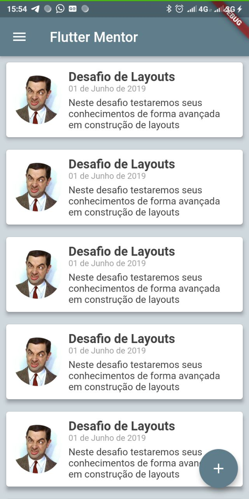
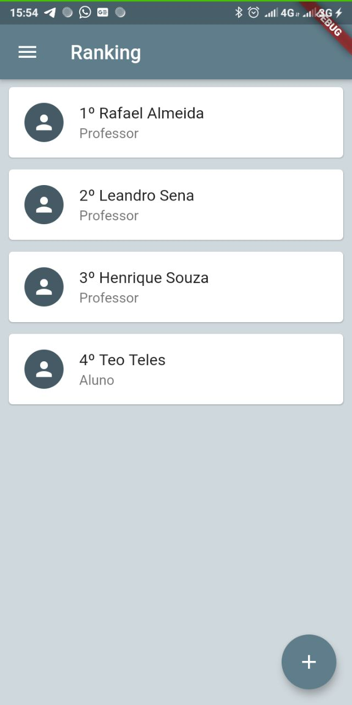

# Flutter Mentor

## Tópicos que o aplicativo aborda

### - Método de aprendizado contínuo

### - Modelo de aprendizagem por perguntas

### - Nivelamento de conteúdo

### - Níveis de usuários (Mentores e alunos)

### - Ranking de colaboração

### - Ranking de alunos (Pontos resposta)

### - Círculo de aprendizado

### - Mentor também é aluno

### - Gamificação por experiência

### - Atingir graus mais altos te torna um mentor

## Colaboladores

- [ Rafael Almeida](https://github.com/RafaelBarbosatec)
- [ Téogenes Teles](https://github.com/teocteles)
- [ Henrique Menezes](https://github.com/HenriqueMachine)
- [ Leandro Sena](https://github.com/leosena777)
- [ João Paulo Santos](https://github.com/joaopaulons)
